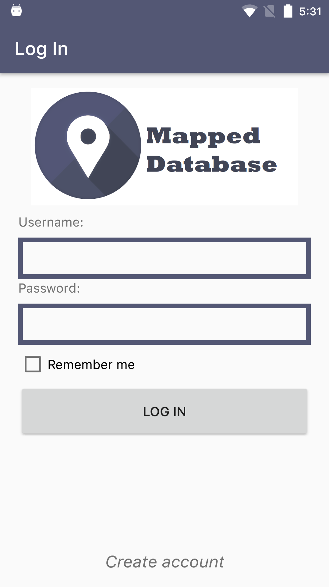
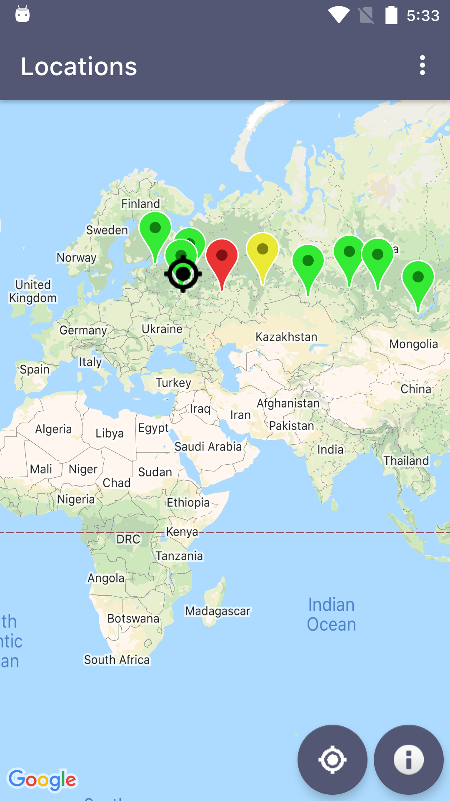
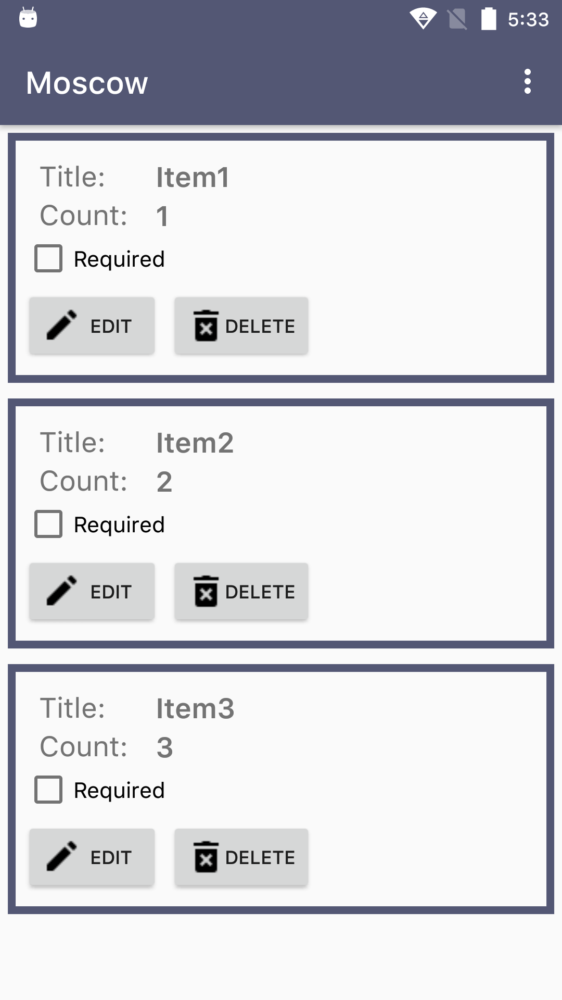

# Mapped Database

A simple example project for app <---> backend interaction. Used libraries:

- RxJava
- Koin
- Google Firebase Cloud Messaging
- Google Firebase Crashlytics
- Timber
- Retrofit
- Picasso

Architecture: MVVM

Features:

* Add / Edit / Delete locations (for admin accounts only)
* Add / Edit / Delete / Block users (for admins account only)
* Add / Edit / Delete items in locations
* Settings
* Notifications
* Tracking current user's location

[Backend](https://github.com/sizeofanton/MappedDatabase-Backend)

